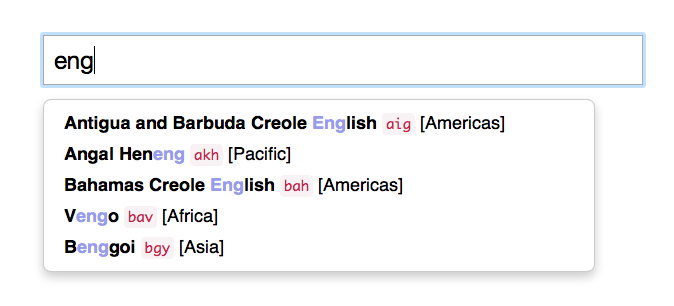

# Auto Completion of Languages

This is a simple Flask app that provides an auto-completion endpoint for a
typeahead module, as demonstrated in `example.html`.
The data for the endpoint is loaded from https://td.unfoldingword.org/exports/langnames.json

## To Run

### Server (manual)
* `pip install flask`
* `python3 main.py`

### Server (Docker)
* `docker pull unfoldingword/language-search`
* `docker run -d -p 5000:5000 unfoldingword/language-search`

### Client
* In a separate terminal, from inside this project directory, run: `python3 -m http.server 8888`
* Go to <http://localhost:8888/example.html>, and start entering language queries.

*For now, selecting a language just saves it to a `
`.*

